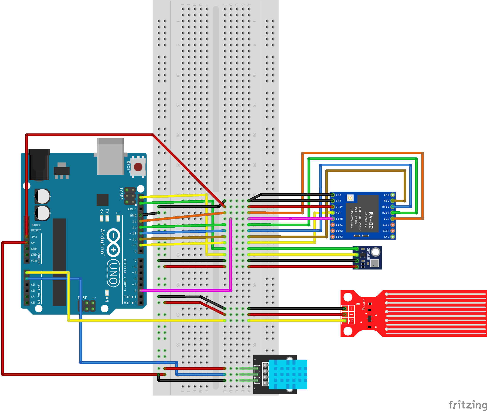

# Summary

Arduino UNO with LoRa module sends processed data to ESP8266.  
ESP8266 to Blynk for monitoring.  

**Practical Uses**: smarthomes - automated heating/cooling, provide real-time weather data, collect weather patterns overtime...

# Components

## Required functionality

Measure humidity, temperature, pressure, rainfall.  
Lora node collects data from sensors, process data, transmit to gateway (with ESP8266).  
Collected data are displayed on mobile app.  
Notification when weather parameter exceeds a threshhold.

## Parts list

- [Arduino UNO](https://hshop.vn/vietduino-uno)
- [Module RF SPI Lora SX1278 433MHz](https://hshop.vn/mach-thu-phat-rf-spi-lora-sx1278-433mhz-ra-02-dip) (2)
- [433MHz antenna](https://hshop.vn/anten-433mhz-3dbi-ipex)
- [ESP8266](https://hshop.vn/kit-rf-thu-phat-wifi-esp8266-nodemcu) Dev Board/12 
- [Water sensor](https://hshop.vn/cam-bien-nuoc-mua-v2-rain-water-sensor) (rainfall sensor)
- [DHT11](https://hshop.vn/cam-bien-do-am-nhiet-do-dht11) (temp, humidity sensor)
- [BMP180](https://nshopvn.com/product/cam-bien-ap-suat-khong-khi-bmp180/) (pressure sensor)

# Schematics

## Transmitter

  

## Receiver